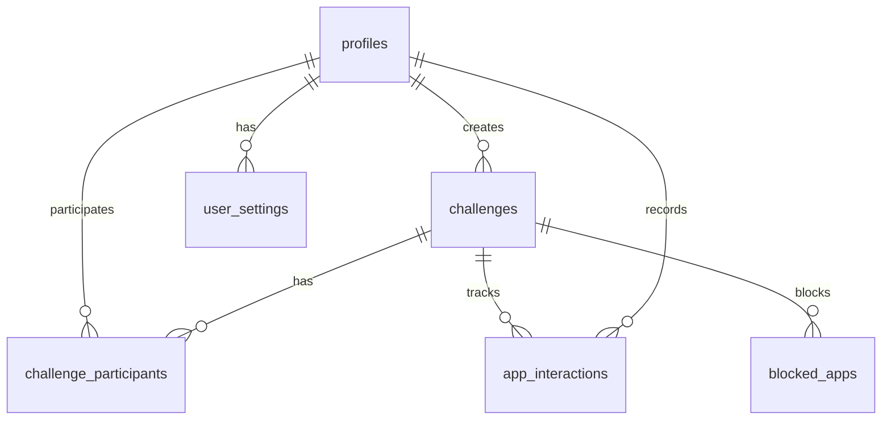

# Database Schema

This directory contains the declarative schema definitions for our Supabase database.

## Schema Organization

Files are loaded in the following order (as defined in `supabase/config.toml`):

1. `setup.sql` - Initial setup

   - Enum types
   - Schema creation
   - Global permissions

2. Tables (in order of dependencies):

   - `01_profiles.sql` - User profiles
   - `02_challenges.sql` - Challenge definitions
   - `03_app_interactions.sql` - App usage tracking
   - `04_user_settings.sql` - User preferences
   - `05_challenge_participants.sql` - Challenge participation
   - `06_blocked_apps.sql` - Apps blocked in challenges

3. Other Schema Objects:
   - `functions.sql` - Database functions
   - `triggers.sql` - Database triggers
   - `policies.sql` - Row Level Security policies
   - `views.sql` - Database views

## Table Relationships



## Enum Types

- `privacy_mode`: `'named' | 'anonymous'`
- `interaction_action`: `'blocked' | 'resisted' | 'override'`
- `platform`: `'ios' | 'android'`

## Development Workflow

1. Make schema changes in the appropriate files
2. Generate a migration:
   ```bash
   supabase db diff -f my_migration_name
   ```
3. Review the generated migration in `supabase/migrations/`
4. Apply the migration:
   ```bash
   supabase db push
   ```

## Table Details

### profiles

- Primary user table
- Created automatically on user signup via trigger
- Contains basic user information and preferences

### challenges

- Digital wellbeing challenges
- Can be individual or group challenges
- Includes time-based restrictions and goals

### app_interactions

- Tracks user interactions with blocked apps
- Records when users resist or override blocks
- Includes mood and intention tracking

### user_settings

- User-specific settings and preferences
- Notification preferences
- Bedtime settings

### challenge_participants

- Links users to challenges
- Tracks participation status
- Identifies accountability partners

### blocked_apps

- Apps blocked within challenges
- Platform-specific app identifiers
- Grouped by challenge

## Security

- All tables have Row Level Security (RLS) enabled
- Policies are defined in `policies.sql`
- Users can only access their own data and challenges they participate in
- Anonymous access is restricted
